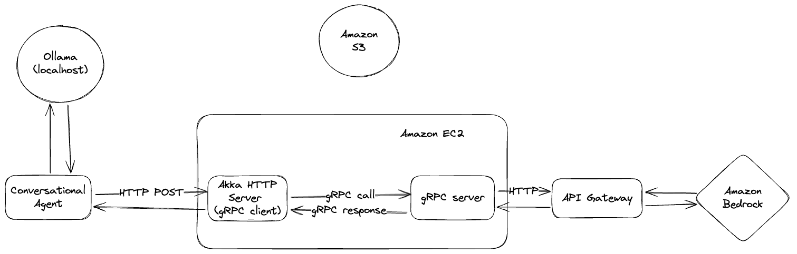

### Student information
First Name: Manh \
Last Name: Nguyen \
UIN: 650327734 \
UIC Mail: mnguy104@uic.edu \
Link to youtube video: 

## Homework 3
### Description
Description is in [here](./Homeworks/Homework3.md).
### Requirements
The project has been ran by using the following version. 
```
JDK 11 
Scala 3.3.4 
Go 1.23 
Python3.9 
```
I haven't got time to test with other version but suspect little/no modification will be required.

### Architecture


### Comments
Homework assignment 3 asked student to write a Conversational Agent that talk with a RESTful server and a local Ollama server setup. \
The set up is as follow: 
- Set up an Amazon Bedrock model lambda function that can be invoke through API Gateway. 
- Set up a gRPC server run inside an EC2 instance that can communicate to API Gateway through HTTP call.
- Set up a RESTful API server (also a gRPC Client) that receive call from Conversational Agent, and then produce a gRPC call to the gRPC server
- Set up a Conversational Agent that call RESTful server through HTTP POST call method. This server also forward the response of the call to a local Ollama server locate in localhost.

#### Minor
- We can set up AkkaHTTP server and gRPC inside one EC2 instance to reduce complexity, also they should share the same protobuf file.

### Structure
- The `src` folder contain main scala code for the project. \
RestfulAPI implementation is provided in `RESTServer.scala` \
Folder `utils` contain Config and Log implementation \
Conversational Agent is implemented in `ConversationalAgent.scala`

- The `lambda` folder contain lambda function for AWS Bedrock model
- The `grpc-server` folder contain Go implementation of the gRPC server

## Deployment

### Run locally

Start from current (.)  

Step to run AkkaHTTP server:

```
sbt clean compile
sbt "runMain com.llmchat.RESTServer"
```

Step to run gRPC server:
```
cd grpc-server
go run server/main.go
```

Step to run locally:

```
sbt clean compile
sbt "runMain com.llmchat.ConversationalAgent How does dog express love ?"
sbt clean compile test
```

### Deploy to EC2

- Create an EC2 instance that suitable for use (ideally with more than 4GB RAM and 20GB memory)
- Set up Security Group for EC2 instance, allow HTTP over TCP at port 8000 for REST server and port 22 for ssh.
- SSH into the EC2 instance, clone this repo
- Install java, scala, go with the specified version
- Run RESTful server and gRPC server 

## Limitation
